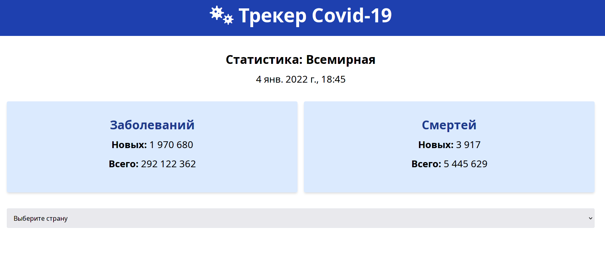

# Vue.js COVID-19 Tracker

Проект использует:
1. Tailwind CSS
2. covid19api.com
3. Moment.js

* * *
Результат работы можно посмотреть тут: <a href="https://covid-19.noble24.pro/" target="_blank">  </a> и <a href="https://tracker-covid19-noble24.netlify.app/" target="_blank">  </a>
* * *

[](https://wakatime.com/badge/user/387a55ad-b952-4b4b-a858-04fb88e1e94c/project/27738abd-4dec-4cd2-8130-e2bc18f8a150)



---

## Project setup
```
npm install
```

### Compiles and hot-reloads for development
```
npm run serve
```

### Compiles and minifies for production
```
npm run build
```

### Customize configuration
See [Configuration Reference](https://cli.vuejs.org/config/).
